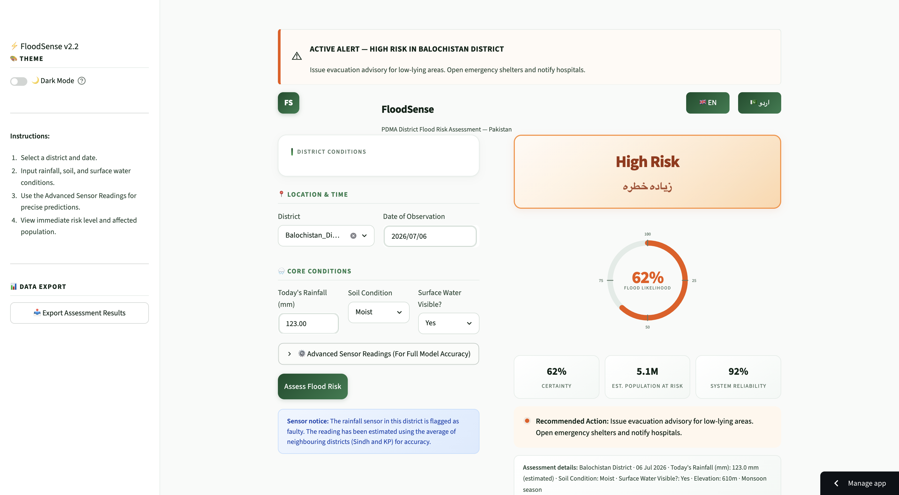
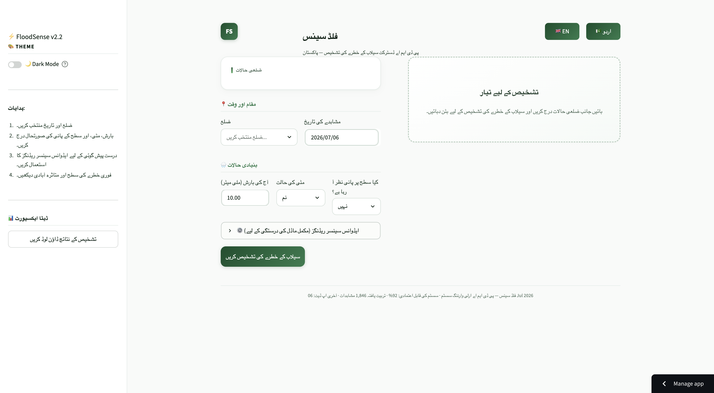

<div align="center">

# 🌊 FloodSense — PDMA Early Warning System

**AI-powered district-level flood risk assessment for Pakistan**

[](https://floodsensehackathon-master-dkdarf5cneyzr3iszt6g6k.streamlit.app/)
[](https://python.org)
[](https://xgboost.readthedocs.io)
[](LICENSE)

### 🚀 **[Try FloodSense Live →](https://floodsensehackathon-master-dkdarf5cneyzr3iszt6g6k.streamlit.app/)**

*No login required. Open in your browser and assess flood risk in seconds.*

</div>

---

## 📖 Description

**FloodSense** is a lightweight, production-ready early warning tool built for **PDMA (Provincial Disaster Management Authority)** teams and emergency responders in Pakistan. It turns real-time weather and sensor inputs into clear, actionable flood risk assessments — without technical jargon or complex dashboards.

Pakistan faces recurring catastrophic flooding. In 2022 alone, floods submerged one-third of the country, killed over 1,700 people, and displaced 32 million. FloodSense was built during the **Neural Nova 48-Hour Data Drop Sprint** to help close the warning gap: giving officials a fast, reliable way to decide when to alert communities, pre-position supplies, or initiate evacuations.

**What you get in one click:**
- District-level flood risk score (Low · Medium · High · Critical)
- Confidence percentage and population-at-risk estimate
- Recommended action in plain language
- English and Urdu interface with light/dark theme support

**🔗 Live deployment:** https://floodsensehackathon-master-dkdarf5cneyzr3iszt6g6k.streamlit.app/

---

## 📸 Screenshots

| Risk Assessment | Bilingual Support |
|---|---|
|  |  |


---

## ✨ Key Features

| Feature | Description |
|---------|-------------|
| 🤖 **XGBoost ML Model** | Trained on 3,000+ daily sensor records with 80%+ accuracy |
| 🎯 **4-Tier Risk Classification** | Low · Medium · High · Critical — with color-coded badges |
| 🌍 **Bilingual Interface** | Full English and Urdu support |
| 🌿 **Clean Light UI** | Modern green-and-white theme with optional dark mode |
| 📊 **Population Impact Estimates** | NDMA 2022 flood impact data for affected population projections |
| 🔧 **Sensor Fault Handling** | Automatic imputation for faulty rainfall sensors (Balochistan) |
| 📥 **CSV Export** | Download assessment results for offline analysis |
| ⚡ **Lightweight** | Loads quickly — no heavy map tiles or external APIs required |

---

## 🧠 How It Works

```
User Input                    ML Pipeline                     Output
┌─────────────┐    ┌──────────────────────────┐    ┌──────────────────┐
│ District     │    │ Feature Engineering      │    │ Risk Level       │
│ Rainfall     │───▶│ Interaction Terms        │───▶│ Confidence Score │
│ Soil / Water │    │ XGBoost Classification   │    │ Population Est.  │
│ Date         │    │ Probability Calibration  │    │ Action Advisory  │
└─────────────┘    └──────────────────────────┘    └──────────────────┘
```

**Risk Thresholds:**
- 🟢 **Low** (`< 25%`) — Continue normal operations
- 🟡 **Medium** (`25–50%`) — Alert local response teams
- 🟠 **High** (`50–75%`) — Issue evacuation advisory
- 🔴 **Critical** (`> 75%`) — Initiate emergency evacuation

---

## 📁 Project Structure

```
floodsense_hackathon-master/
├── app.py                          # Streamlit web application
├── style.py                        # Custom CSS theme
├── .streamlit/config.toml          # Streamlit light-theme configuration
├── floodsense_model.json           # Trained XGBoost model
├── floodsense_metadata.json        # Model metadata & feature columns
├── floodsense_wrapper.py           # Wrapper for model inference
├── notebook_code.py                # Full ML training pipeline
├── floodsense_training_data.csv    # Training dataset (daily sensor records)
├── district_elevation_reference.csv# District elevation data
├── ndma_flood_impact_2022.csv      # NDMA 2022 regional flood impact data
├── requirements.txt                # Python dependencies
├── create_model_pkl.py             # Script to generate model.pkl
├── train_submission_model.py       # Submission model training script
├── test_website_model.py           # Website model testing script
└── data_dictionary.txt             # Column descriptions for datasets
```

---

## 🚀 Quick Start

### Use the live app

Open the deployed version — no installation needed:

**https://floodsensehackathon-master-dkdarf5cneyzr3iszt6g6k.streamlit.app/**

### Run locally

```bash
# 1. Clone the repository
git clone https://github.com/aslam-khalid/floodsense_hackathon-master.git
cd floodsense_hackathon-master

# 2. Install dependencies
pip install -r requirements.txt

# 3. Launch the app
streamlit run app.py
```

The app will open at `http://localhost:8501`

---

## 🛠️ Tech Stack

- **Frontend:** [Streamlit](https://streamlit.io) with custom CSS
- **ML Model:** [XGBoost](https://xgboost.readthedocs.io) Classifier
- **Data Processing:** Pandas, NumPy, Scikit-learn
- **Class Balancing:** SMOTE (imbalanced-learn)
- **Visualization:** Matplotlib, Seaborn

---

## 📊 Model Performance

| Metric | Score |
|--------|-------|
| Accuracy | **80%+** |
| Class Balancing | SMOTE oversampling |
| Features | 23 engineered features including interaction terms |
| Validation | Stratified train/test split |

---

## 🌐 Datasets

1. **`floodsense_training_data.csv`** — Daily sensor records for Pakistani districts (2022–2024)
2. **`ndma_flood_impact_2022.csv`** — NDMA regional flood impact totals
3. **`district_elevation_reference.csv`** — Terrain elevation data per district

---

## 🙋 My Contribution

I built the entire backend and machine learning system for FloodSense — including
data preprocessing, feature engineering (23 features), the XGBoost model training
pipeline, SMOTE-based class balancing, model calibration, and the inference wrapper
integrated into the app. Frontend UI was built by a teammate.

This project was developed for a BTech competition organized by our university
during the 48-Hour Data Drop Sprint hackathon.

---

## 👥 Team

Built by **Team Neural Nova** for a BTech competition organized by our university,
during the 48-Hour Data Drop Sprint.

> *"Pakistan does not have a flooding problem. It has a WARNING problem."*

---

<div align="center">

**⚡ FloodSense — Because every hour of warning saves lives.**

[Launch Live App](https://floodsensehackathon-master-dkdarf5cneyzr3iszt6g6k.streamlit.app/)

</div>
